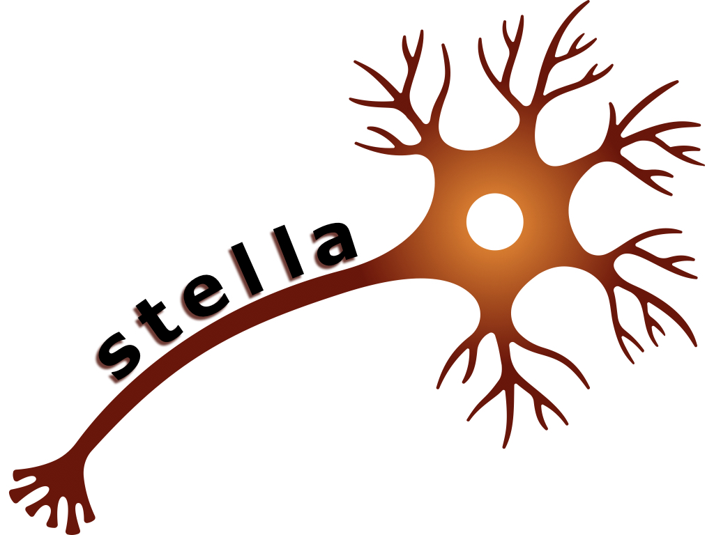

  

  
  

stella is a Python package to create and train a neural network to identify stellar flares.
Within stella, users can simulate flares as a training set, run a neural network, and feed
in their own data to the neural network model. stella returns a probability at each data point
that that data point is part of a flare or not. stella can also characterize the flares identified.

To install stella with pip:

	pip install stella

Alternatively you can install the current development version of stella:

        git clone https://github.com/afeinstein20/stella
        cd stella
        python setup.py install

